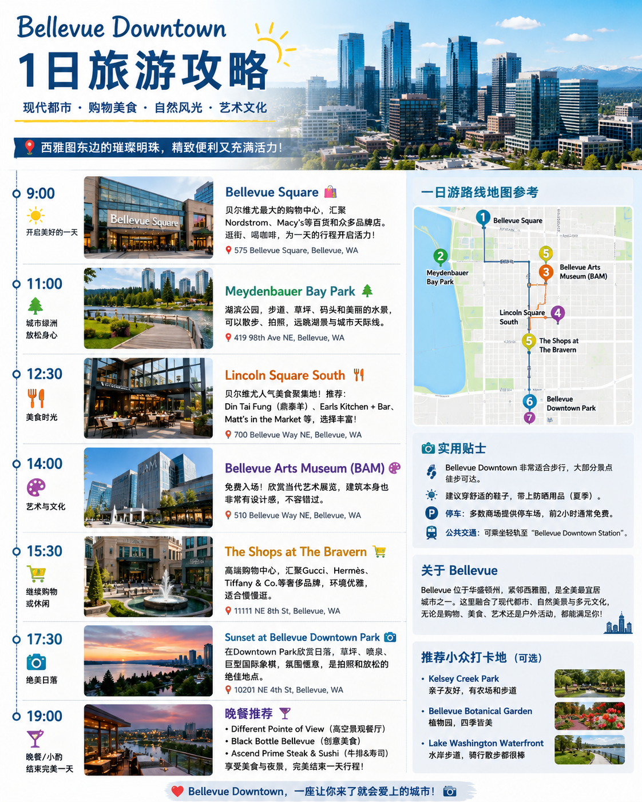

# JourneyFrame

**AI-powered conversational trip planner delivered through iMessage.**

Text a message like *"My friend Sarah is visiting Seattle tomorrow. Plan a cozy rainy-day afternoon for us."* — and JourneyFrame texts back a full personalized itinerary with cinematic scene images.

---

## Demo

**Input (iMessage):**
> My friend Sarah is visiting Seattle tomorrow. Plan a cozy rainy-day afternoon for us.

**Output:**



---

## How It Works

```
iMessage → Photon Spectrum → FastAPI Backend → RocketRide Pipeline → gpt-image-2 → iMessage
```

### RocketRide 6-Stage Wave Pipeline

| Stage | Node | What It Does |
|---|---|---|
| 1 | Intent Parser | Extracts location, occasion, relationship, vibe, time, constraints |
| 2 | Context Enricher | Adds weather, preferences, relationship context, local tips |
| 3 | Itinerary Planner | Generates 3–5 stops with emotional purpose |
| 4 | Experience Narrator | Writes warm iMessage-style messages |
| 5 | Image Prompt Generator | Creates cinematic travel poster prompt |
| 6 | Response Composer | Assembles final iMessage-ready response |

Stages 4 and 5 run **in parallel** within the same RocketRide wave.

---

## Stack

| Layer | Technology |
|---|---|
| AI Pipeline | [RocketRide](https://rocketride.ai) wave agent + `agent_rocketride` |
| LLM | Claude Sonnet 4.6 (Anthropic) |
| Image Generation | gpt-image-2 (OpenAI) |
| iMessage Gateway | [Photon Spectrum](https://photon.codes) + `spectrum-ts` |
| Backend | FastAPI + Python |
| Delivery | iMessage via Photon Spectrum cloud |

---

## Project Structure

```
JourneyFrame/
├── backend/              # FastAPI backend
│   ├── main.py           # Webhook endpoint, pipeline orchestration
│   ├── rocketride_runner.py  # RocketRide SDK client
│   └── pipeline/         # Fallback direct Claude pipeline stages
├── rocketride/
│   └── journeyframe.pipe # RocketRide visual pipeline definition
├── spectrum/             # Photon Spectrum Node.js gateway
│   └── src/index.ts      # iMessage listener + reply sender
└── demo/                 # Demo assets
```

---

## Setup

### Backend
```bash
cd backend
cp .env.example .env      # fill in ANTHROPIC_API_KEY, OPENAI_API_KEY
pip install -r requirements.txt
uvicorn main:app --port 8000
```

### Spectrum Gateway
```bash
cd spectrum
cp .env.example .env      # fill in PHOTON_PROJECT_ID, PHOTON_PROJECT_SECRET
npm install
npm run dev
```

### RocketRide
1. Install the [RocketRide VS Code extension](https://marketplace.visualstudio.com/items?itemName=RocketRide.rocketride)
2. Click **Deploy → Local** to start the local server on `localhost:5565`
3. Set `ROCKETRIDE_APIKEY=local` in `backend/.env`

---

Built for **HackWithSeattle** · Powered by RocketRide + Photon Spectrum
